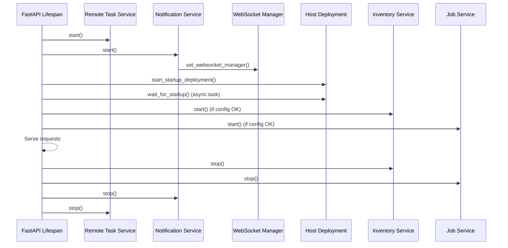
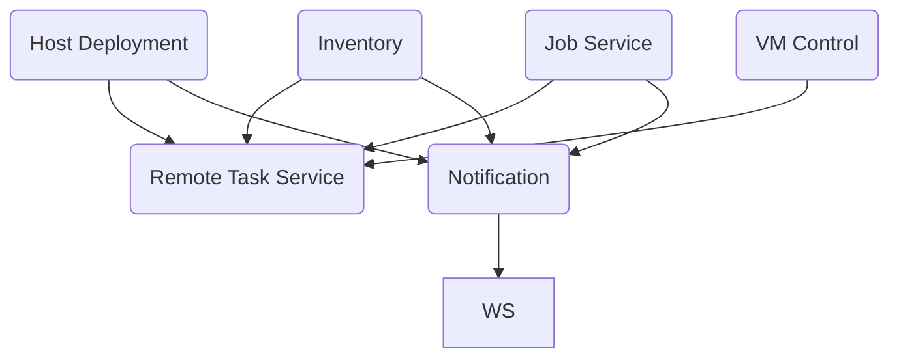

# Aether-V Architecture, Operations, and Deployment Guide

This guide provides deployment engineers, day-two operators, and future developers with a cohesive overview of how Aether-V is packaged, launched, and orchestrated. It builds on the component deep-dives in the existing documentation set (see [Detailed Documentation](#detailed-documentation)) and focuses on cross-cutting lifecycle and service relationships.

## Guiding Principles

- **Stateless orchestration:** The control plane maintains no persistent datastore. All state is reconstructed in-memory from live Hyper-V hosts at runtime, reducing operational burden and failure surface area.
- **Delegated platform services:** Availability, authentication, authorization, and TLS termination are delegated to the hosting platform (Kubernetes ingress controller, OIDC identity provider, and underlying infrastructure) to minimise bespoke code and security exposure.
- **In-memory coordination:** Short-lived data (jobs, notifications, inventory caches) reside in process memory and are rebuilt on restart, which simplifies backups and adheres to the stateless philosophy.
- **Composable services:** Each service has a clear contract and is orchestrated through explicit dependency management, enabling targeted troubleshooting and future enhancements without expanding the blast radius.

## Packaging and Delivery Model

| Artifact | Purpose | Build Source |
| --- | --- | --- |
| `server/Dockerfile` | Multi-stage build that installs Python dependencies, captures build metadata, and embeds curated agent artifacts for distribution. The resulting image exposes FastAPI via Uvicorn on port 8000. | [`server/Dockerfile`](../server/Dockerfile) |
| Kubernetes manifests | Namespace, ConfigMap, Secret, Deployment, Service, and Ingress definitions for production rollouts. | [`server/k8s/`](../server/k8s) |
| Agent artifacts | PowerShell deployment scripts, provisioning ISOs, and version metadata distributed to Hyper-V hosts. | [`Powershell/`, `ISOs/`, `Scripts/Build-ProvisioningISOs.ps1`](../Scripts/Build-ProvisioningISOs.ps1) |
| Guest provisioning bundles | OS-specific provisioning entrypoints and module fragments executed inside the VM guest. | [`Windows/`, `Linux/`](../Windows) |

The container image assembles Python application code (`server/app`), JSON schemas (`Schemas/`), and agent artifacts (`/app/agent` in the image). Host deployment relies on these embedded assets to synchronise Hyper-V hosts during startup.

## High-Level Application Topology

```mermaid
flowchart LR
    subgraph Kubernetes
        API[FastAPI Application]\n`app.main`
        WS[WebSocket Endpoint]
    end
    subgraph Services
        RT[Remote Task Service]
        HD[Host Deployment Service]
        INV[Inventory Service]
        JOB[Job Service]
        NOT[Notification Service]
        VM[VM Control Service]
    end
    subgraph External Systems
        HV[Hyper-V Hosts]
        AG[Host Agent Scripts\n+ ISOs]
        VMGuest[Guest Provisioning Agents]
        Browser[User Browser]
        FE[Frontend Templates]\n`app/templates`
        OIDC[OIDC Provider]
    end

    API --> WS
    API --> NOT
    API --> JOB
    API --> INV
    API --> VM

    NOT --> WS
    JOB --> RT
    HD --> RT
    INV --> RT
    VM --> RT

    RT --> HV
    HD --> AG
    HV --> AG
    AG --> VMGuest

    WS --> Browser
    FE --> Browser
    API --> OIDC
```

## Service Responsibilities and Interactions

### Remote Task Service (`app/services/remote_task_service.py`)
- Central asynchronous queue with adaptive concurrency for remote WinRM operations.
- Provides back-pressure management and timeout categorisation for deployment, inventory, and job workloads.
- All host-touching services (host deployment, inventory, job execution, VM control) submit tasks through this service.

### Host Deployment Service (`app/services/host_deployment_service.py`)
- Distributes bundled scripts/ISOs to Hyper-V hosts and verifies agent versions during startup and on demand.
- Depends on the remote task service for WinRM calls and on notification service for user-facing status updates.
- Exposes readiness signals used by the inventory and job services before they start processing.

### Inventory Service (`app/services/inventory_service.py`)
- Maintains in-memory models of clusters, hosts, and VMs by polling Hyper-V through remote tasks.
- Waits for host deployment readiness and publishes status to the notification service.
- Provides cached state for API routes, job validation, and user interface views.

### Job Service (`app/services/job_service.py`)
- Accepts user-submitted provisioning and lifecycle jobs, enqueues remote execution, and streams progress via WebSockets.
- Coordinates with host deployment to ensure scripts are available, inventory service for VM context, and notification service for outcome alerts.

### Notification Service (`app/services/notification_service.py`)
- Aggregates system and job notifications in-memory and forwards them to WebSocket clients.
- Announces configuration validation results and long-running operational events.

### WebSocket Manager (`app/services/websocket_service.py`)
- Multiplexes real-time updates to browser clients and other WebSocket subscribers.
- Receives notifications directly and can be referenced by job and inventory services for targeted broadcasts.

### VM Control and WinRM Services
- `vm_control_service.py` and `winrm_service.py` encapsulate VM-specific PowerShell orchestration and WinRM session management that underpin higher-level services.

## Application Startup and Lifespan

The FastAPI application utilises an explicit lifespan context (`app/main.py`) to stage services in dependency order. On startup, services are initialised to ensure Hyper-V interactions are available only when prerequisites succeed.



Configuration validation occurs before service initialisation. If blocking errors are detected, the job and inventory services are withheld, yet the API still runs in a diagnostic mode so operators can resolve issues.

## Runtime Service Dependencies



The runtime dependency graph emphasises that the remote task service underpins host interactions, while the notification service and WebSocket manager form the observability spine.

## Application Lifespan and Availability Considerations

- **Scaling:** Multiple replicas can run concurrently because all state is transient. Kubernetes readiness probes (`/readyz`) and liveness probes (`/healthz`) protect rolling updates.
- **High availability:** Rely on Kubernetes replica management and ingress load-balancing rather than bespoke clustering. Ensure shared agent artifacts (ISOs/scripts) are made available to all pods during the image build.
- **Authentication/Authorization:** Managed by the configured OIDC provider. Role-to-scope mappings are resolved in `core/auth` modules, reducing local credential handling.
- **Observability:** Leverage Kubernetes logging (`kubectl logs`) and optional external aggregators. Notifications emitted over WebSockets surface operational context to the UI.

## End-to-End Component Relationships

```mermaid
flowchart TB
    subgraph Control Plane
        API[FastAPI API & UI]
        WS[WebSocket Manager]
        Services[Services Layer]
    end
    subgraph Host Layer
        HVHost[Hyper-V Host]
        AgentScripts[Deployed Agent Scripts\n(ISOs + PowerShell)]
        RemoteRunner[WinRM Session]
    end
    subgraph Guest Layer
        GuestAgent[Guest Provisioning Service]
        Modules[OS-Specific Modules]
    end
    subgraph User Layer
        Browser[Browser UI]
    end

    Browser -->|HTTPS| API
    Browser -->|WebSocket| WS
    API --> Services
    Services -->|WinRM via Remote Task| RemoteRunner
    RemoteRunner --> HVHost
    HVHost --> AgentScripts
    AgentScripts --> GuestAgent
    GuestAgent --> Modules
```

This lifecycle illustrates how user interactions propagate through stateless services, leverage WinRM for host orchestration, deploy assets to Hyper-V, and culminate in guest-side provisioning sequences.

## Operational Runbook Highlights

### For Deployment Engineers
- Build container images via the multi-stage Dockerfile; ensure `Scripts/Build-ProvisioningISOs.ps1` has generated ISOs prior to `docker build`.
- Populate Kubernetes `ConfigMap` and `Secret` manifests with environment-specific credentials and host lists before applying manifests.
- Confirm the container registry hosts the bundled agent artifacts, as the host deployment service pulls from `/app/agent` inside each pod.

### For Day-Two Operators
- Monitor startup logs for configuration validation errors; the notification overlay will mirror these via the notification service.
- Use `/healthz` and `/readyz` for Kubernetes probes and ad-hoc diagnostics.
- Inspect real-time notifications and job streams through the WebSocket-enabled UI to track provisioning progress.

### For Developers
- Service modules live in `server/app/services/`. All host interactions route through `remote_task_service` — integrate new functionality by adding task producers rather than new concurrency mechanisms.
- Schemas and validation logic reside in `server/app/core/` and `Schemas/`. Update JSON schemas alongside business logic for consistent API validation.
- Templates and static assets under `server/app/templates/` and `server/app/static/` back the built-in UI; leverage FastAPI routers in `server/app/api/` for new API endpoints.

## Detailed Documentation

Refer to the following documents for deeper dives:

- [Modular Provisioning System](./Modular-Provisioning-System.md)
- [Agent Deployment Service](./agent-deployment-service.md)
- [Inventory Refresh](./inventory-refresh.md)
- [Job Queue Service](./job-queue-service.md)
- [WebSocket Real-Time Updates](./WebSocket-Real-Time-Updates.md)

These guides describe implementation specifics, configuration nuances, and extension points for each subsystem.
