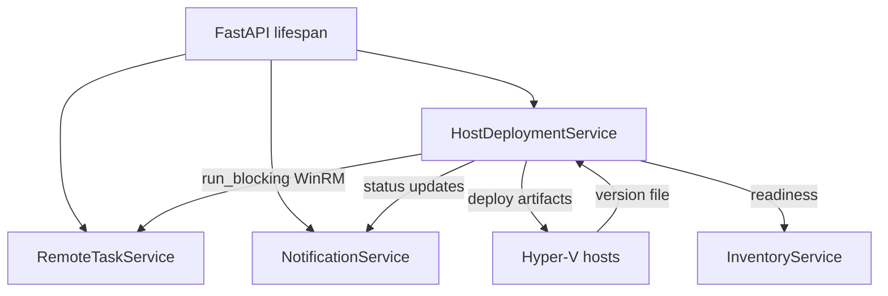

# Agent deployment service

The agent deployment service keeps the Hyper-V hosts aligned with the provisioning assets packaged into the container image. It is responsible for comparing versions, orchestrating background WinRM tasks, and publishing readiness updates so that provisioning only begins once all prerequisites are met.

## Startup placement and dependencies
- The service initialises during FastAPI lifespan startup alongside the remote task and notification services. `start_startup_deployment()` launches a background coroutine, marks progress metadata, and immediately returns so the API can continue booting while host updates proceed asynchronously.
- Startup progress uses the shared notification service to surface a persistent "Agent deployment" banner that tracks successes, failures, and provisioning availability. The service also exposes metrics for troubleshooting and readiness checks.
- All remote operations run through the remote task service with the `DEPLOYMENT` category, ensuring bounded concurrency and consistent timeout handling for all WinRM calls.

## Configuration and host placement
- `HOST_INSTALL_DIRECTORY` selects where PowerShell helpers and ISOs land on every Hyper-V host. The default remains `C:\Program Files\Aether-V`, but any Windows path (including network shares) is valid so long as the WinRM service account can create directories and write files.
- Separate installation directories make it simple to run production, testing, and development orchestrators against the same hosts without collisions. Each instance maintains its own version file and artifact cache, so paths such as `C:\\Program Files\\Aether-V (Devel)` or `C:\\Program Files\\Aether-V (Test)` keep environments isolated.
- `AGENT_DOWNLOAD_BASE_URL` must resolve from every Hyper-V host. It points at the orchestrator's `/agent` HTTP endpoint and is used when building download URLs for each artifact.
- When experimenting with custom layouts, verify NTFS permissions and Windows path length limits. The WinRM user needs write access to the chosen directory and any parent folders.

### Example overrides
```powershell
# Production
HOST_INSTALL_DIRECTORY=C:\Program Files\Aether-V

# Development sandbox
HOST_INSTALL_DIRECTORY=C:\Program Files\Aether-V (Devel)

# Network share (ensure credentials grant write access)
HOST_INSTALL_DIRECTORY=\\FileServer\Share\AetherV
```

## Version verification workflow
- On startup `_load_container_version()` reads the container's `version` file, normalises the text, logs warnings when the value is missing, and clears any cached host state.
- Each host check invokes `_get_host_version()` via WinRM, reading the remote `{HOST_INSTALL_DIRECTORY}\version` file with UTF-8 fallback, trimming BOMs and null characters, and returning a normalised string when possible.
- `_assess_host_version()` compares the host and container values, handling blank or unparsable versions gracefully and only requiring redeployment when the container version is newer or the host value is missing/default.
- `ensure_host_setup()` caches verified matches, records per-host status, and only triggers `_deploy_to_host()` when the assessment indicates an update is required.

## Ingress readiness gating
- Before any redeployment begins the service polls the ingress health endpoint derived from `AGENT_DOWNLOAD_BASE_URL`. `_wait_for_agent_endpoint_ready()` keeps startup responsive by returning early when the health check succeeds, and logs a timeout warning before proceeding if the ingress never responds.
- This logical dependency ensures hosts never attempt to download artifacts while ingress still responds with `503 Service Unavailable`.

## Deployment process
- `_deploy_to_host()` re-checks the host version just before making changes, skipping the rollout if a concurrent update already completed.
- Host deployment steps:
  1. `_collect_script_files()` / `_collect_iso_files()` enumerate artifacts under `/app/agent` so new assets ship automatically with each container build.
  2. `_clear_host_install_directory()` and `_verify_install_directory_empty()` reset the target directory via WinRM.
  3. `_deploy_all_artifacts_parallel()` deploys all artifacts (scripts, ISOs, and version file) in a single WinRM session using PowerShell background jobs for parallel downloads. Each download uses `Invoke-WebRequest` and respects retry/back-off settings (`AGENT_DOWNLOAD_MAX_ATTEMPTS` and `AGENT_DOWNLOAD_RETRY_INTERVAL`) when downloads fail.
  4. `_verify_expected_artifacts_present()` ensures every expected file exists before declaring success.
  5. `ensure_host_setup()` caches the matched version for subsequent readiness checks.

### Deployed artifacts
Each host receives a consistent layout inside `{HOST_INSTALL_DIRECTORY}`:

**PowerShell scripts**

- `Invoke-ProvisioningJob.ps1` – master orchestrator that reads JSON job definitions and calls helper scripts.
- `Provisioning.CopyImage.ps1` – clones the requested golden image into the VM working directory.
- `Provisioning.CopyProvisioningISO.ps1` – stages Windows or Linux provisioning media beside the VM.
- `Provisioning.RegisterVM.ps1` – registers the VM with Hyper-V and applies CPU, memory, and networking settings.
- `Provisioning.WaitForProvisioningKey.ps1` – blocks until the guest reports readiness through Hyper-V KVP.
- `Provisioning.PublishProvisioningData.ps1` – publishes configuration payloads into the guest via KVP.
- `Inventory.Collect.ps1` – gathers host inventory used by the API.

**Provisioning media**

- `WindowsProvisioning.iso`
- `LinuxProvisioning.iso`

**Version tracking**

- `version` – matches the container build so the service can detect drift.

### Version management and transport
- The container embeds its canonical version inside `/app/agent/version`. Hosts store their last deployed version inside `{HOST_INSTALL_DIRECTORY}\version`, and comparisons use semantic version ordering.
- Artifact downloads use a single WinRM connection with parallel PowerShell background jobs (`Start-Job`), dramatically reducing deployment time by eliminating repeated WinRM connection overhead. Each job downloads its artifact via HTTP(S) using `Invoke-WebRequest`, so even large ISOs avoid WinRM payload limits. Downloads retry up to `AGENT_DOWNLOAD_MAX_ATTEMPTS` with `AGENT_DOWNLOAD_RETRY_INTERVAL` delays to tolerate transient ingress warm-ups.
- Because the deployment service enumerates `/app/agent` at runtime, any new script or asset added during the build automatically participates in rollout without code changes.

## Notifications, readiness, and inventory integration
- Startup deployment progress is published through `notification_service.upsert_agent_deployment_notification`, updating totals, failures, and provisioning availability as hosts complete.
- `ensure_inventory_ready()` bridges to the inventory service by reusing cached version matches, exposing whether a host is ready, still updating, or encountered an error.
- `get_metrics()` surfaces current startup status, ingress readiness, and host caches for diagnostics endpoints.

## Legacy context
- Early versions relied on two manual PowerShell installers (`InstallHostScripts.ps1` and `InstallHostProvisioningISOs.ps1`) that pulled artifacts from GitHub releases and tracked separate version files for scripts and ISOs.
- The integrated deployment service replaces those manual steps with a single version file, container-scoped assets, and automatic updates on startup, eliminating external dependencies while keeping development environments flexible through custom installation directories.

## Troubleshooting and validation
- **Directory creation failures** – confirm the WinRM account can create folders, the path is valid, and you are below Windows path length limits.
- **Persistent version mismatches** – inspect `{HOST_INSTALL_DIRECTORY}\version`, ensure the file is writable, and verify the container shipped the expected version.
- **HTTP 503 or readiness warnings** – double-check `AGENT_DOWNLOAD_BASE_URL` reachability and run a container build that reports transitional readiness states (`deploying_agents`, `initializing`). The service retries downloads automatically during transient ingress warm-ups.
- **Artifacts missing inside guest VMs** – confirm provisioning scripts reference `HOST_INSTALL_DIRECTORY` and that ISO copies succeed before VM registration.
- **Smoke tests** – from a host, run `Test-Path` against the installation directory, list the contents, and view the `version` file to confirm deployments landed in the expected path.
- **Multiple environments** – assign unique installation directories per orchestrator instance (for example `C:\\Program Files\\Aether-V (Test1)` and `(Test2)`) so each keeps separate artifacts, versioning, and operational state.

## Mermaid overview


## Summary
The agent deployment service keeps provisioning assets in sync by comparing container and host versions, waiting for ingress readiness, and coordinating WinRM deployment tasks in the background. Its notifications and readiness checks ensure provisioning only begins once hosts report the expected artifacts.
