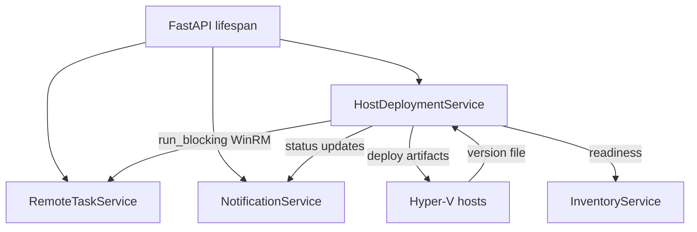

# Agent deployment service

The agent deployment service keeps the Hyper-V hosts aligned with the provisioning assets packaged into the container image. It is responsible for comparing versions, orchestrating background WinRM tasks, and publishing readiness updates so that provisioning only begins once all prerequisites are met.

## Startup placement and dependencies
- The service initialises during FastAPI lifespan startup alongside the remote task and notification services. `start_startup_deployment()` launches a background coroutine, marks progress metadata, and immediately returns so the API can continue booting while host updates proceed asynchronously.
- Startup progress uses the shared notification service to surface a persistent "Agent deployment" banner that tracks successes, failures, and provisioning availability. The service also exposes metrics for troubleshooting and readiness checks.
- All remote operations run through the remote task service with the `DEPLOYMENT` category, ensuring bounded concurrency and consistent timeout handling for all WinRM calls.

## Version verification workflow
- On startup `_load_container_version()` reads the container's `version` file, normalises the text, logs warnings when the value is missing, and clears any cached host state.
- Each host check invokes `_get_host_version()` via WinRM, reading the remote `{HOST_INSTALL_DIRECTORY}\version` file with UTF-8 fallback, trimming BOMs and null characters, and returning a normalised string when possible.
- `_assess_host_version()` compares the host and container values, handling blank or unparsable versions gracefully and only requiring redeployment when the container version is newer or the host value is missing/default.
- `ensure_host_setup()` caches verified matches, records per-host status, and only triggers `_deploy_to_host()` when the assessment indicates an update is required.

## Ingress readiness gating
- Before any redeployment begins the service polls the ingress health endpoint derived from `AGENT_DOWNLOAD_BASE_URL`. `_wait_for_agent_endpoint_ready()` keeps startup responsive by returning early when the health check succeeds, and logs a timeout warning before proceeding if the ingress never responds.
- This logical dependency ensures hosts never attempt to download artifacts while ingress still responds with `503 Service Unavailable`.

## Deployment process
- `_deploy_to_host()` re-checks the host version just before making changes, skipping the rollout if a concurrent update already completed.
- Host deployment steps:
  1. `_collect_script_files()` / `_collect_iso_files()` enumerate artifacts under `/app/agent` so new assets ship automatically with each container build.
  2. `_clear_host_install_directory()` and `_verify_install_directory_empty()` reset the target directory via WinRM.
  3. `_download_file_to_host()` streams each artifact over HTTP using `Invoke-WebRequest`, respecting retry/back-off settings when downloads fail.
  4. `_verify_expected_artifacts_present()` ensures every expected file exists before declaring success.
  5. `ensure_host_setup()` caches the matched version for subsequent readiness checks.

## Notifications, readiness, and inventory integration
- Startup deployment progress is published through `notification_service.upsert_agent_deployment_notification`, updating totals, failures, and provisioning availability as hosts complete.
- `ensure_inventory_ready()` bridges to the inventory service by reusing cached version matches, exposing whether a host is ready, still updating, or encountered an error.
- `get_metrics()` surfaces current startup status, ingress readiness, and host caches for diagnostics endpoints.

## Mermaid overview

## Summary
The agent deployment service keeps provisioning assets in sync by comparing container and host versions, waiting for ingress readiness, and coordinating WinRM deployment tasks in the background. Its notifications and readiness checks ensure provisioning only begins once hosts report the expected artifacts.
