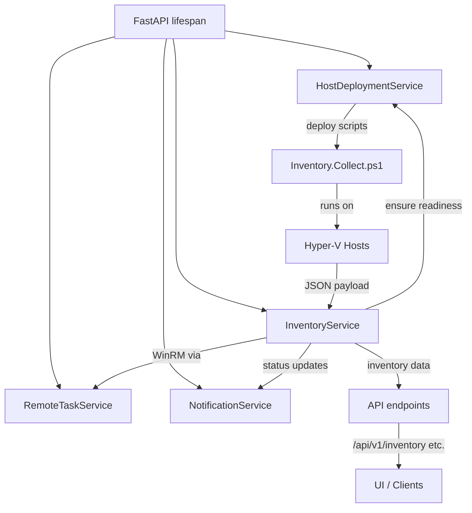

# Inventory refresh service

The inventory refresh service keeps Aether-V's in-memory model of clusters, hosts, and virtual machines synchronised with each Hyper-V host. It owns host/VM records, emits operational notifications, and coordinates with host deployment, remote task orchestration, and WinRM execution.

## Startup and bootstrapping
- `inventory_service.start()` now runs immediately after the remote task and notification services, before the job service, so the first refresh can begin while host deployment still rolls out updates.
- The bootstrap coroutine no longer blocks on host deployment completion. Each host refresh asks `host_deployment_service.ensure_inventory_ready()` for a readiness summary so version mismatches are deferred while connectivity failures continue into the normal refresh flow.
- Hosts flagged with out-of-date deployment artifacts record a transient `Host` entry with `"Preparing host, will retry later"`, raise an informational notification, and skip refreshes until deployment reports the expected version; connectivity failures bypass the skip so unreachable notifications still surface.

## Refresh lifecycle
- Startup schedules the initial full refresh (`reason="startup"`) plus the staggered background loop. Both flows honour the host-level readiness check before contacting WinRM.
- The background loop sorts hosts deterministically, spaces calls across the configured interval, and accumulates per-cycle metadata, including which hosts were refreshed or deferred.
- Single-host refreshes update the `Host` and `VM` registries, preserve job placeholders, and clean up missing VMs. Failures generate host-unreachable notifications while keeping placeholder VMs intact.

## Host communication and recovery
- WinRM calls run through `remote_task_service.run_blocking` with the `INVENTORY` category, giving inventory work its own concurrency lane and timeout enforcement. Script execution errors trigger targeted redeploy attempts before escalating.
- `host_deployment_service.ensure_inventory_ready()` now returns a readiness summary, caching verified versions, flagging hosts that are still updating artifacts, and surfacing connection errors so inventory can raise unreachable notifications.

## Concurrency and isolation
- An `asyncio.Lock` serialises refresh mutations so manual triggers, the initial sync, and the background loop cannot interleave updates to shared dictionaries.
- Remote work for inventory, deployments, and jobs share the remote task service, but each category is dispatched separately to prevent a stuck task from starving others. Background deployment uses a semaphore to bound concurrent WinRM sessions.
- Job orchestration still tracks placeholder VMs so concurrent provisioning cannot corrupt the visible inventory state.

## Notifications and readiness
- Cycle-completion notifications include refreshed vs. deferred hosts and the rolling average host refresh duration, while system notifications warn when a single host refresh exceeds the configured interval.
- When the rolling average per-host refresh time pushes past the configured interval, the service surfaces an "Inventory refresh saturation" warning explaining that hosts are too slow for the selected cadence and pointing operators toward retuning the schedule or investigating host performance.
- Preparatory skips raise informational notifications until the host completes deployment; warnings clear automatically once refresh durations fall back under the interval.
- The readiness endpoint now reports `ready` as soon as configuration validation passes, independent of inventory status, so HTTP endpoints become routable immediately.

## Metrics and diagnostics
- `inventory_service.get_metrics()` now exposes the rolling average single-host refresh time, refresh sample count, and tracked sets of preparing/slow hosts alongside per-host timestamps.
- Deployment diagnostics continue to publish per-host setup status, providing context for hosts still flagged as preparing.

## Mermaid overview

## External triggers
- VM lifecycle endpoints continue to `asyncio.create_task(inventory_service.refresh_inventory())` so manual actions schedule an immediate refresh without blocking the request path.

## Summary
The inventory service now launches earlier, gates each host refresh on deployment readiness, and surfaces granular diagnostics—average refresh times, slow-host warnings, and preparation status—while preserving robust concurrency boundaries through the shared remote task service.
