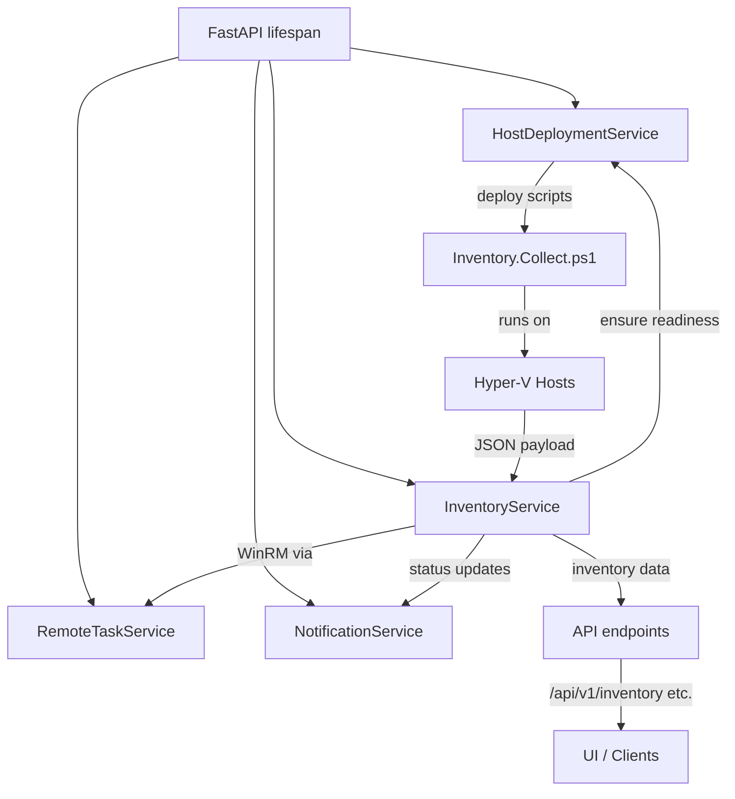

# Inventory refresh service

The inventory refresh service keeps Aether-V's in-memory model of clusters, hosts, and virtual machines synchronised with each Hyper-V host. It owns host/VM records, emits operational notifications, and coordinates with host deployment, remote task orchestration, and WinRM execution.

## Startup and bootstrapping
- `inventory_service.start()` now runs immediately after the remote task and notification services, before the job service, so the first refresh can begin while host deployment still rolls out updates.
- The bootstrap coroutine no longer blocks on host deployment completion. Instead, each host refresh calls `host_deployment_service.ensure_inventory_ready()` to verify the installed script version matches the running container.
- When a host is still preparing artifacts, the service records a transient `Host` entry with `"Preparing host, will retry later"`, raises an informational notification, and skips the refresh until the deployment service reports a match.【F:server/app/services/inventory_service.py†L52-L65】【F:server/app/services/inventory_service.py†L627-L675】

## Refresh lifecycle
- Startup schedules the initial full refresh (`reason="startup"`) plus the staggered background loop. Both flows honour the host-level readiness check before contacting WinRM.【F:server/app/services/inventory_service.py†L115-L169】【F:server/app/services/inventory_service.py†L353-L422】
- The background loop sorts hosts deterministically, spaces calls across the configured interval, and accumulates per-cycle metadata, including which hosts were refreshed or deferred.【F:server/app/services/inventory_service.py†L353-L409】
- Single-host refreshes update the `Host` and `VM` registries, preserve job placeholders, and clean up missing VMs. Failures generate host-unreachable notifications while keeping placeholder VMs intact.【F:server/app/services/inventory_service.py†L675-L751】

## Host communication and recovery
- WinRM calls run through `remote_task_service.run_blocking` with the `INVENTORY` category, giving inventory work its own concurrency lane and timeout enforcement. Script execution errors trigger targeted redeploy attempts before escalating.【F:server/app/services/inventory_service.py†L780-L861】【F:server/app/services/remote_task_service.py†L105-L204】
- `host_deployment_service.ensure_inventory_ready()` caches verified container versions per host so subsequent refreshes skip redundant version checks. Failed checks or deployments clear the cache entry so the next refresh will retry.【F:server/app/services/host_deployment_service.py†L70-L116】【F:server/app/services/host_deployment_service.py†L118-L141】

## Concurrency and isolation
- An `asyncio.Lock` serialises refresh mutations so manual triggers, the initial sync, and the background loop cannot interleave updates to shared dictionaries.【F:server/app/services/inventory_service.py†L564-L623】
- Remote work for inventory, deployments, and jobs share the remote task service, but each category is dispatched separately to prevent a stuck task from starving others. Background deployment uses a semaphore to bound concurrent WinRM sessions.【F:server/app/services/remote_task_service.py†L37-L215】【F:server/app/services/host_deployment_service.py†L708-L770】
- Job orchestration still tracks placeholder VMs so concurrent provisioning cannot corrupt the visible inventory state.【F:server/app/services/inventory_service.py†L986-L1020】

## Notifications and readiness
- Cycle-completion notifications include refreshed vs. deferred hosts and the rolling average host refresh duration, while system notifications warn when a single host refresh exceeds the configured interval.【F:server/app/services/inventory_service.py†L409-L447】【F:server/app/services/inventory_service.py†L715-L770】
- Preparatory skips raise informational notifications until the host completes deployment; warnings clear automatically once refresh durations fall back under the interval.【F:server/app/services/inventory_service.py†L627-L675】【F:server/app/services/inventory_service.py†L715-L770】
- The readiness endpoint now reports `ready` as soon as configuration validation passes, independent of inventory status, so HTTP endpoints become routable immediately.【F:server/app/api/routes.py†L198-L227】

## Metrics and diagnostics
- `inventory_service.get_metrics()` now exposes the rolling average single-host refresh time, refresh sample count, and tracked sets of preparing/slow hosts alongside per-host timestamps.【F:server/app/services/inventory_service.py†L1043-L1118】
- Deployment diagnostics continue to publish per-host setup status, providing context for hosts still flagged as preparing.【F:server/app/services/host_deployment_service.py†L714-L969】

## Mermaid overview

## External triggers
- VM lifecycle endpoints continue to `asyncio.create_task(inventory_service.refresh_inventory())` so manual actions schedule an immediate refresh without blocking the request path.【F:server/app/api/routes.py†L126-L154】

## Summary
The inventory service now launches earlier, gates each host refresh on deployment readiness, and surfaces granular diagnostics—average refresh times, slow-host warnings, and preparation status—while preserving robust concurrency boundaries through the shared remote task service.
