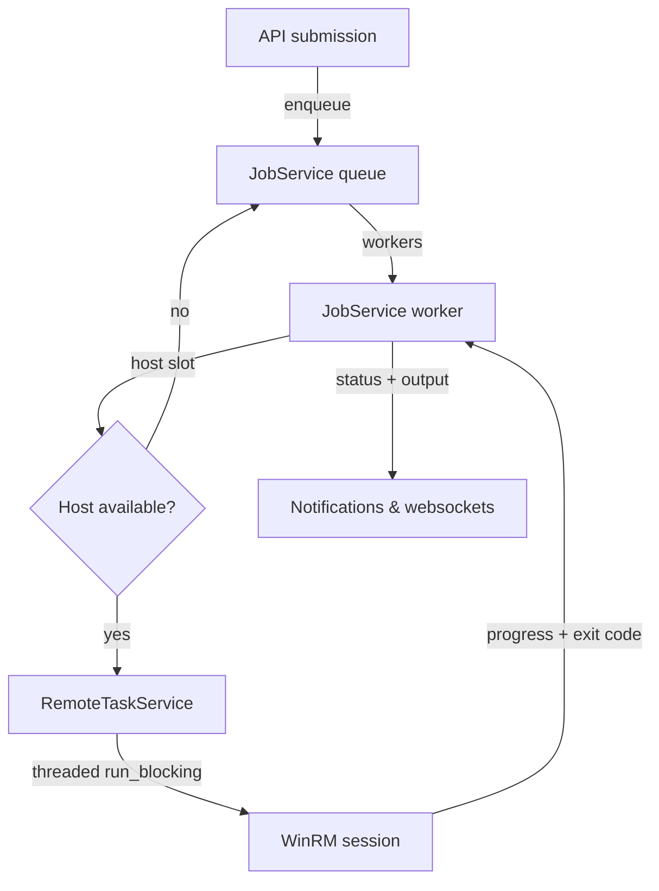

# Job queue and remote execution services

The job queue coordinates provisioning work across Hyper-V hosts while shielding
FastAPI request handlers from blocking WinRM calls. Two collaborating services
power this layer:

- **JobService** – accepts schema-validated submissions, tracks lifecycle state,
  and serialises provisioning jobs per host so that Hyper-V nodes stay healthy.
- **RemoteTaskService** – executes blocking functions in worker threads with
  adaptive concurrency limits, enforcing categories and timeouts.

## Responsibilities and workflow
- API handlers call `submit_provisioning_job`, which persists metadata, emits
  notifications, and enqueues the job identifier on an asyncio queue.
- `JobService.start()` spawns `settings.job_worker_concurrency` worker tasks that
  pull from the queue, transition jobs into the running state, and delegate host
  execution.
- Each provisioning job must confirm the agent deployment service has finished
  preparing assets before invoking the PowerShell runner.
- `_execute_provisioning_job` serialises the job definition, builds the
  invocation command, and schedules the blocking WinRM call through the remote
  task service.

## Host-level serialisation
- The job service now enforces a **single provisioning job per host** policy via
  `_acquire_host_slot` / `_release_host_slot`. Jobs targeting the same Hyper-V
  node wait on an internal queue until the active job finishes.
- Reservations follow a fair FIFO order. When a job completes, the next waiter is
  granted the host slot before new submissions can start, preventing starvation
  and guaranteeing only one WinRM provisioning session per host at a time.
- The per-host lock is transparent to callers: submissions still succeed
  immediately and progress updates continue to flow through notifications and
  websockets while queued jobs wait for their turn.

## Remote execution and isolation
- `remote_task_service.run_blocking` wraps each provisioning call in
  `asyncio.to_thread`, so every job runs inside its own worker thread with an
  independent WinRM session from `winrm_service.stream_ps_command`.
- Remote tasks are categorised (`RemoteTaskCategory.JOB`) to apply longer
  timeouts and to route provisioning work onto the dedicated job worker pool.
- The remote task service dynamically scales "fast" workers based on queue depth
  and system resource sampling while keeping the job pool at a fixed concurrency
  configured by `settings.remote_task_job_concurrency`.
- Adaptive scaling honours CPU and memory thresholds, expanding only when the
  system has headroom, and automatically shrinks idle workers after
  `remote_task_idle_seconds` to avoid unnecessary load.

## Notifications, metrics, and observability
- `_sync_job_notification` keeps a persistent banner updated with per-job
  metadata, including VM name, host, and current status.
- Websocket broadcasts surface granular job state transitions and streamed
  stdout/stderr lines so operators can follow provisioning progress in real time.
- `get_metrics()` exposes queue depth, running counts, worker totals, and the
  configured concurrency. Remote task metrics report worker pool sizing,
  resource utilisation, and scaling adjustments for dashboards.

## Mermaid overview

## Design principles
- **Deterministic concurrency** – asynchronous workers manage queueing, but host
  serialisation ensures Hyper-V stability and predictable resource usage.
- **Isolation** – per-job threads and WinRM sessions contain failures to a single
  provisioning task, preventing cascading errors across the queue.
- **Adaptive throughput** – the remote task service scales only when telemetry
  permits, balancing job latency against orchestrator CPU and memory limits.
- **Operator visibility** – rich notifications, websocket updates, and metrics
  expose queue health and per-job status without attaching debuggers to worker
  threads.

## Operational tips
- Adjust `settings.job_worker_concurrency` (environment variable
  `JOB_WORKER_CONCURRENCY`) to tune how many hosts can provision concurrently;
  the host-level lock will keep individual nodes safe even at higher global
  concurrency.
- Monitor remote task metrics for sustained `maxed_out_for_seconds` values – if
  the job pool saturates and hosts are still idle, consider increasing the job
  concurrency ceiling.
- Investigate jobs that linger in the pending state: they are either waiting for
  host slots or for the agent deployment service to finish preparing assets.
- Each job retains streamed output in `job.output`; reviewing the tail helps
  diagnose PowerShell or guest OS failures without logging into the host.
