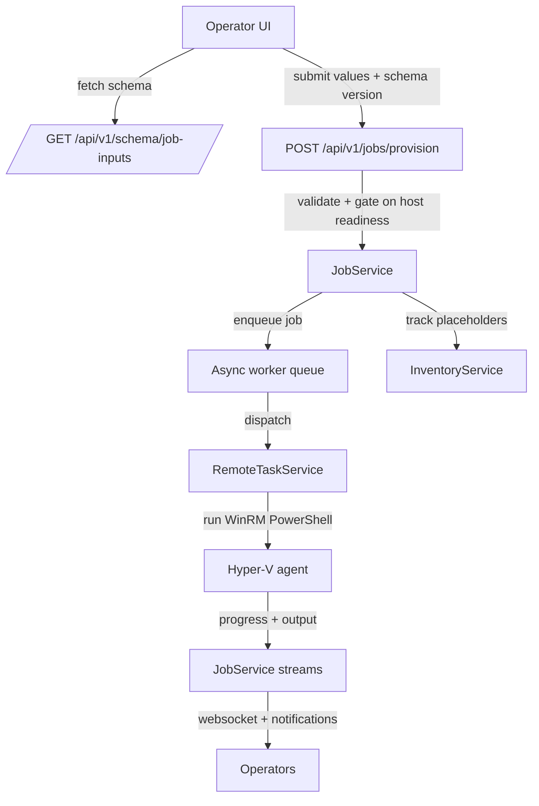

# Virtual machine provisioning service

The virtual machine provisioning service links the FastAPI control plane with the
Hyper-V PowerShell agent through a schema-driven workflow. It validates requests,
queues jobs behind an asyncio worker pool, and streams live output back to
operators while keeping inventory and notifications in sync.

## Schema-driven interface
- `/api/v1/schema/job-inputs` exposes the currently active schema so the UI can
  render adaptive forms and collect values that comply with backend expectations.
  Each submission echoes the schema version to prevent mismatches during rolling
  upgrades.
- The schema lives in `Schemas/job-inputs.yaml` and defines field metadata,
  validation rules, conditional parameter sets, and applicability filters. This
  structure allows the frontend to render context-sensitive inputs (for example,
  Windows-specific domain join fields) without hard-coding logic.
- `validate_job_submission` normalises user input, applies cross-field
  constraints (such as all-or-none parameter sets), and surfaces actionable
  validation errors before any remote work is attempted.

## Submission pipeline and host safeguards
- Provisioning requests call `submit_provisioning_job`, which re-checks the
  schema version, verifies target host connectivity against the inventory
  snapshot, and blocks duplicate VM names. It also guards against job starts
  while the agent deployment service reports incomplete rollouts.
- Each accepted request is converted into a portable job definition containing
  the schema identifier, version, and cleaned field map. This JSON envelope is
  stored with the job and sent to the Hyper-V agent so backend and agent
  implementations can evolve independently as long as they agree on the schema
  contract.

## Queueing, workers, and resilience
- `JobService.start()` initialises an asyncio queue and launches the configured
  number of worker tasks. Each submission acquires the lock, persists metadata,
  publishes notifications, and enqueues the job ID for background execution.
- Worker loops transition jobs into the running state, wrap execution in
  try/except blocks, and ensure failures are captured without crashing sibling
  jobs. Completion, failure, and error details propagate through `_update_job`
  so downstream listeners receive consistent lifecycle events.
- `get_metrics` summarises queue depth, worker count, and job status tallies for
  diagnostics endpoints and dashboards, helping operators spot saturation or
  stuck work.

## Remote execution and streaming output
- `_execute_provisioning_job` waits for `ensure_host_setup` to finish preparing
  artifacts, encodes the job definition as JSON, and dispatches the PowerShell
  runner through the remote task service so synchronous WinRM calls do not block
  the event loop.
- `RemoteTaskService` multiplexes blocking tasks across separate fast and job
  queues, dynamically scaling worker counts based on backlog and resource
  sampling. Timeouts and categories protect the service from runaway executions
  while keeping long-running provisioning scripts isolated from lighter work.
- Streaming callbacks feed stdout/stderr chunks into a `_PowerShellStreamDecoder`
  that understands CLI XML payloads and hexadecimal escapes, ensuring operators
  receive clean, incremental log lines over websockets and notifications.

## Cross-service coordination and observability
- Job updates drive persistent notifications, websocket broadcasts (per-job and
  aggregate), and inventory placeholders that mark in-progress VMs so UI views
  show accurate state even before Hyper-V reports the new machine.
- On status transitions the service publishes summaries via the notification
  service, captures sensitive parameters with schema-aware redaction, and clears
  placeholder VMs once jobs resolve. These safeguards keep operator messaging and
  audit history aligned with actual provisioning outcomes.

## Schema-to-agent contract
- The job definition stored with each request mirrors the schema and cleaned
  values, enabling the Hyper-V PowerShell script to parse a consistent JSON
  payload. `_build_master_invocation_command` base64-encodes this JSON and pipes
  it into `Invoke-ProvisioningJob.ps1` on the host.
- Within the script, `Read-ProvisioningJobDefinition` accepts JSON from standard
  input or the PowerShell pipeline, validates presence, and materialises a rich
  object model for downstream provisioning steps. Agent authors can evolve the
  PowerShell logic independently, provided they honour the schema contract and
  field identifiers supplied by the API.
- Because both sides rely on the same schema identifiers and versioning, frontend
  teams can introduce new form elements while agent developers extend their
  automation, coordinating via schema reviews rather than tightly coupled API
  changes. Backwards compatibility is enforced by the version check at
  submission time, preventing mismatched deployments from queuing incompatible
  jobs.

## Mermaid overview

## Summary
The provisioning service exposes a schema-versioned contract to the UI, validates
and enqueues jobs behind resilient asyncio workers, and offloads blocking WinRM
work to a dynamically scaled remote task pool. Live streaming, notification
updates, and inventory integration keep operators informed while the shared
schema and JSON job definitions allow the API and agent codebases to evolve on
independent cadences.
