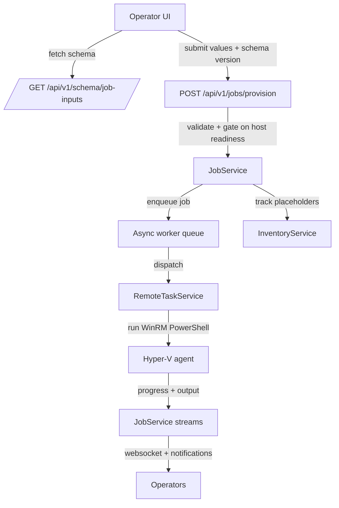

# Virtual machine provisioning service

The virtual machine provisioning service links the FastAPI control plane with the
Hyper-V PowerShell agent through a schema-driven workflow. It validates requests,
queues jobs behind an asyncio worker pool, and streams live output back to
operators while keeping inventory and notifications in sync.

## Schema-driven interface
- `/api/v1/schema/job-inputs` exposes the currently active schema so the UI can
  render adaptive forms and collect values that comply with backend expectations.
  Each submission echoes the schema version to prevent mismatches during rolling
  upgrades.
- The schema lives in `Schemas/job-inputs.yaml` and defines field metadata,
  validation rules, conditional parameter sets, and applicability filters. This
  structure allows the frontend to render context-sensitive inputs (for example,
  Windows-specific domain join fields) without hard-coding logic.
- `validate_job_submission` normalises user input, applies cross-field
  constraints (such as all-or-none parameter sets), and surfaces actionable
  validation errors before any remote work is attempted.

## Submission pipeline and host safeguards
- Provisioning requests call `submit_provisioning_job`, which re-checks the
  schema version, verifies target host connectivity against the inventory
  snapshot, and blocks duplicate VM names. It also guards against job starts
  while the agent deployment service reports incomplete rollouts.
- Each accepted request is converted into a portable job definition containing
  the schema identifier, version, and cleaned field map. This JSON envelope is
  stored with the job and sent to the Hyper-V agent so backend and agent
  implementations can evolve independently as long as they agree on the schema
  contract.

## Queueing, workers, and resilience
- `JobService.start()` initialises an asyncio queue and launches the configured
  number of worker tasks. Each submission acquires the lock, persists metadata,
  publishes notifications, and enqueues the job ID for background execution.
- Worker loops transition jobs into the running state, wrap execution in
  try/except blocks, and ensure failures are captured without crashing sibling
  jobs. Completion, failure, and error details propagate through `_update_job`
  so downstream listeners receive consistent lifecycle events.
- `get_metrics` summarises queue depth, worker count, and job status tallies for
  diagnostics endpoints and dashboards, helping operators spot saturation or
  stuck work.

## Remote execution and streaming output
- `_execute_provisioning_job` waits for `ensure_host_setup` to finish preparing
  artifacts, encodes the job definition as JSON, and dispatches the PowerShell
  runner through the remote task service so synchronous WinRM calls do not block
  the event loop.
- `RemoteTaskService` multiplexes blocking tasks across separate fast and job
  queues, dynamically scaling worker counts based on backlog and resource
  sampling. Timeouts and categories protect the service from runaway executions
  while keeping long-running provisioning scripts isolated from lighter work.
- Streaming callbacks feed stdout/stderr chunks into a `_PowerShellStreamDecoder`
  that understands CLI XML payloads and hexadecimal escapes, ensuring operators
  receive clean, incremental log lines over websockets and notifications.

## Host-side provisioning flow
- Each job serialises the schema identifier, version, and cleaned field map into
  a compact JSON envelope that mirrors the payload consumed by the original
  Ansible playbook. The JSON is base64-encoded and piped into
  `Invoke-ProvisioningJob.ps1` so the PowerShell agent can evolve independently
  from the API as long as both sides honour the schema contract.
- `Invoke-ProvisioningJob.ps1` orchestrates the following sequence, matching the
  historical tooling step-for-step:
  1. **Pre-provisioning checks** – derives the operating system family when not
     supplied, ignoring Windows-only fields for Linux images and vice versa.
  2. **`Provisioning.CopyImage.ps1`** – clones the requested golden image into a
     host working directory and returns the path for subsequent steps.
  3. **`Provisioning.CopyProvisioningISO.ps1`** – places the Windows or Linux
     provisioning ISO beside the VM so Hyper-V can attach it during
     registration.
  4. **`Provisioning.RegisterVM.ps1`** – creates and starts the VM with the
     requested CPU, memory, storage, VLAN, and ISO attachments.
  5. **`Provisioning.WaitForProvisioningKey.ps1`** – watches Hyper-V key-value
     pairs until the guest posts the `ProvisioningReady` signal.
  6. **`Provisioning.PublishProvisioningData.ps1`** – encrypts sensitive
     configuration data and injects it into the guest through KVP for
     autonomous completion.
- Optional clustering is invoked from the same master script after provisioning
  data is published so that Failover Cluster integration mirrors the legacy
  workflow.

### Sample job envelope
```json
{
  "schema": {"id": "vm-provisioning", "version": 1},
  "fields": {
    "vm_name": "web-server-01",
    "image_name": "Windows Server 2022",
    "gb_ram": 8,
    "cpu_cores": 4
  }
}
```

### Pre-provisioning logic
- OS family inference treats prefixes such as `Windows*`, `Microsoft Windows*`,
  `Ubuntu*`, `RHEL*`, `CentOS*`, `Rocky Linux*`, `AlmaLinux*`, `Oracle Linux*`,
  `Debian*`, `SUSE*`, `openSUSE*`, and `Fedora*` as hints so the UI can omit
  redundant fields.
- Linux requests ignore Windows domain join values; Windows requests ignore
  Linux SSH configuration to reduce accidental misconfiguration.

## Cross-service coordination and observability
- Job updates drive persistent notifications, websocket broadcasts (per-job and
  aggregate), and inventory placeholders that mark in-progress VMs so UI views
  show accurate state even before Hyper-V reports the new machine.
- On status transitions the service publishes summaries via the notification
  service, captures sensitive parameters with schema-aware redaction, and clears
  placeholder VMs once jobs resolve. These safeguards keep operator messaging and
  audit history aligned with actual provisioning outcomes.

## Schema-to-agent contract
- The job definition stored with each request mirrors the schema and cleaned
  values, enabling the Hyper-V PowerShell script to parse a consistent JSON
  payload. `_build_master_invocation_command` base64-encodes this JSON and pipes
  it into `Invoke-ProvisioningJob.ps1` on the host.
- Within the script, `Read-ProvisioningJobDefinition` accepts JSON from standard
  input or the PowerShell pipeline, validates presence, and materialises a rich
  object model for downstream provisioning steps. Agent authors can evolve the
  PowerShell logic independently, provided they honour the schema contract and
  field identifiers supplied by the API.
- Because both sides rely on the same schema identifiers and versioning, frontend
  teams can introduce new form elements while agent developers extend their
  automation, coordinating via schema reviews rather than tightly coupled API
  changes. Backwards compatibility is enforced by the version check at
  submission time, preventing mismatched deployments from queuing incompatible
  jobs.

## Configuration parameters
- **Required** – `vm_name`, `image_name`, `gb_ram`, `cpu_cores`, `guest_la_uid`,
  and `guest_la_pw` define the VM identity and baseline resources. Host
  selection occurs separately via the `target_host` submission field.
- **Networking (optional)** – `guest_v4_ipaddr`, `guest_v4_cidrprefix`,
  `guest_v4_defaultgw`, `guest_v4_dns1`, `guest_v4_dns2`, and `guest_net_dnssuffix`
  request static IPv4 configuration. VLAN tagging is controlled with `vlan_id`
  (0 for untagged networks).
- **Domain join (Windows)** – `guest_domain_jointarget`,
  `guest_domain_joinuid`, `guest_domain_joinpw`, and `guest_domain_joinou`
  provide optional Active Directory integration.
- **Linux automation** – `cnf_ansible_ssh_user` and `cnf_ansible_ssh_key`
  deliver post-provisioning SSH configuration for downstream tooling.
- **Clustering** – `vm_clustered` toggles optional Failover Cluster
  registration once the VM finishes provisioning.

## Security considerations
- Secrets such as `guest_la_pw` and `guest_domain_joinpw` are supplied via
  environment variables rather than command-line arguments so they never appear
  in process listings. The agent encrypts payloads before publishing them into
  the guest through Hyper-V KVP.
- KVP data is transient and removed once the guest reads it, keeping
  credentials off the host.
- Job responses redact sensitive fields with `redact_job_parameters`, and
  notifications avoid echoing secrets.

## Operational guidance
- **Golden images** – Sysprep Windows templates, install Hyper-V integration
  services, and bake common updates. Linux templates should ship with
  cloud-init configured for NoCloud and have Hyper-V KVP daemons enabled on
  boot.
- **Networking** – Validate static IP assignments, ensure VLANs exist on the
  Hyper-V virtual switch, and confirm DNS servers are reachable.
- **Domain join** – Use service accounts with rights to create computer
  objects, verify DNS resolution for domain controllers, and consider
  pre-staging objects when policy demands it.

## Monitoring, validation, and troubleshooting
- Successful jobs leave the VM powered on, reachable on the network, and
  publishing provisioning keys via KVP. Inventory placeholders clear when jobs
  complete so dashboards stay accurate.
- Common issues and mitigations:
  - **VM fails to start** – inspect Hyper-V event logs and confirm sufficient
    CPU and RAM availability.
  - **Provisioning timeout** – ensure the provisioning ISO copied correctly and
    the guest OS can mount it.
  - **Static networking missing** – double-check submitted IP, CIDR, gateway,
    and DNS values and look for conflicts on the network.
  - **Domain join failures** – verify credentials, DNS reachability, and domain
    controller access from the new VM.

## API integration
- The REST API exposes `POST /api/v1/jobs/provision` for submissions and
  `GET /api/v1/jobs/{id}` for status checks. Clients include the schema version
  to guard against mismatches during rolling upgrades.
- Example request:
  ```bash
  curl -X POST "https://aetherv.example.com/api/v1/jobs/provision" \
    -H "Authorization: Bearer <token>" \
    -H "Content-Type: application/json" \
    -d '{
          "schema_version": 1,
          "target_host": "hyperv01.local",
          "values": {
            "vm_name": "web-server-01",
            "image_name": "Windows Server 2022",
            "gb_ram": 8,
            "cpu_cores": 4,
            "guest_la_uid": "Administrator",
            "guest_la_pw": "SecurePassword123!",
            "guest_v4_ipaddr": "192.168.1.100",
            "guest_v4_cidrprefix": 24,
            "guest_v4_defaultgw": "192.168.1.1",
            "guest_v4_dns1": "192.168.1.10",
            "guest_domain_jointarget": "example.com",
            "guest_domain_joinuid": "svc-domainjoin",
            "guest_domain_joinpw": "DomainPassword123!",
            "vlan_id": 10
          }
        }'
  ```


## Mermaid overview


## Summary
The provisioning service exposes a schema-versioned contract to the UI, validates
and enqueues jobs behind resilient asyncio workers, and offloads blocking WinRM
work to a dynamically scaled remote task pool. Live streaming, notification
updates, and inventory integration keep operators informed while the shared
schema and JSON job definitions allow the API and agent codebases to evolve on
independent cadences.
