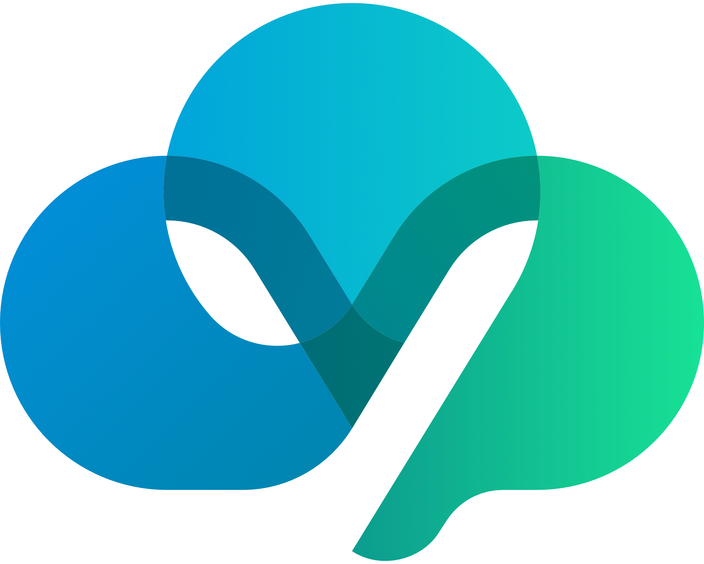
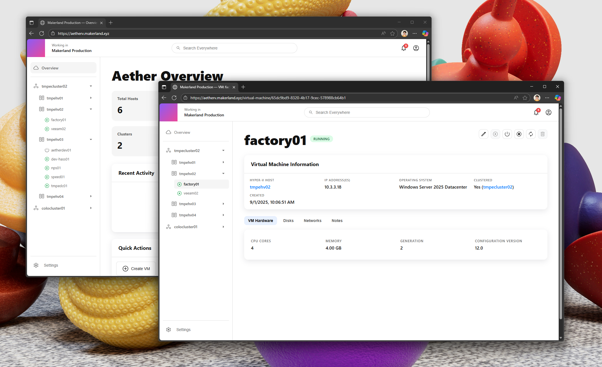

# Aether-V

Aether-V is a unified solution for modern infrastructure management on Hyper-V, providing a complete platform that includes a web frontend, orchestration service, and guest agents. Designed for both homelab and enterprise environments, Aether-V streamlines VM provisioning, configuration, and lifecycle management with secure, resilient architecture.


Background credit [Nigel Hoare](https://unsplash.com/@dementedpixel) used under the [Unsplash License](https://unsplash.com/license)

## Overview

Aether-V enables automated, secure, and scalable management of Hyper-V virtual machines. It features a stateless orchestration service—no persistent storage required—making deployment and scaling simple. All state is reconstructed in-memory from Hyper-V hosts at runtime, ensuring reliability and minimal infrastructure footprint.

## Key Features

- **Unified Platform:** Web UI, REST API, and guest agents for end-to-end VM lifecycle management.
- **Stateless Operation:** No persistent storage or database; service state is always derived from live Hyper-V hosts.
- **Encrypted Provisioning Data:** VM provisioning data is injected via Hyper-V KVP, encrypted so only the VM can access secrets after provisioning.
- **OIDC Authentication:** Enterprise-ready authentication with Microsoft Entra ID (Azure AD) for users and service principals.
- **Containerized & Production-ready:** Easy highly-available deployment in a Kubernetes environment.
- **Authoritative Inventory:** Periodic updates from all hosts.
- **Minimal infrastructure footprint:** No SCVMM or SQL Server Required.

## How It Works

1. **Provisioning:** Host copies image and provisioning media, configures and starts VM.
2. **Secure Data Injection:** Guest VM receives encrypted provisioning data via KVP.
3. **Self-contained Customization:** All secrets remain inside the VM; no external exposure.
4. **Unified Management:** Use the web UI, REST API, or (future) Terraform provider for VM lifecycle operations.

## Getting Started

### Quick Start (Container-based Development)

**Recommended for all developers:**

1. **Clone and open in DevContainer:**
   ```bash
   git clone https://github.com/charlespick/Aether-V.git
   cd Aether-V
   # In VS Code: Reopen in Container
   ```

2. **Start development server:**
   ```bash
   make dev-up
   ```

3. **Access the application:**
   - Web UI: http://localhost:8000
   - API Docs: http://localhost:8000/docs
   - Next UI: http://localhost:8000/next-ui

**See [Docs/DEVELOPMENT.md](Docs/DEVELOPMENT.md) for complete development guide.**

### Prerequisites

- Docker Desktop or Docker Engine with Docker Compose
- Kubernetes cluster (for production deployment)
- Hyper-V hosts with WinRM enabled and Kerberos authentication configured
- OIDC provider (Azure AD recommended) or disable auth for development
- Kerberos keytab for service account with WinRM access

The orchestration service relies on the [`pypsrp`](https://github.com/jborean93/pypsrp) library for PowerShell Remoting Protocol
(PSRP) communication. Ensure the configured WinRM endpoint permits PSRP sessions with Kerberos authentication.

### Development Workflow

```bash
# Start development environment
make dev-up

# Run tests
make test-all              # All test suites
make test-python           # Python only
make test-svelte           # Svelte type checking

# Build assets
make build-assets          # ISOs + next-ui + static files
make build                 # Production container

# View logs
make dev-logs

# Stop environment
make dev-down
```

**Migrating from old setup?** See [Docs/MIGRATION.md](Docs/MIGRATION.md)

### Production Deployment

1. Configure Kubernetes manifests (`server/k8s/`):
    - Namespace, secrets, configmap, deployment, service, ingress
2. Edit secrets and configmap for credentials and settings.
3. Deploy with `kubectl apply -f k8s/<manifest>.yaml`.

## Configuration

All settings are managed via environment variables (ConfigMap/Secrets):

- `DEBUG`, `APP_VERSION`
- `AUTH_ENABLED`, `OIDC_ISSUER_URL`, `OIDC_CLIENT_ID`, `OIDC_CLIENT_SECRET`, `OIDC_API_AUDIENCE`
- `OIDC_READER_PERMISSIONS`, `OIDC_WRITER_PERMISSIONS`, `OIDC_ADMIN_PERMISSIONS`
- `HYPERV_HOSTS`, `WINRM_KERBEROS_PRINCIPAL`, `WINRM_KEYTAB_B64`, `WINRM_PORT`
- `INVENTORY_REFRESH_INTERVAL`
- `HOST_INSTALL_DIRECTORY`
- `AGENT_DOWNLOAD_BASE_URL`

**Important:** Aether-V requires Kerberos authentication for WinRM to support:
- Secure double-hop operations for cluster management
- Credential delegation to shared storage and cluster resources
- Enhanced security over legacy NTLM/Basic/CredSSP

**See [Docs/Kerberos-Authentication.md](Docs/Kerberos-Authentication.md)** for complete setup instructions including:
- Keytab generation
- Resource-Based Constrained Delegation (RBCD) configuration
- Migration from legacy authentication
- Security best practices

Also see [Docs/Configuration.md](Docs/Configuration.md) for all environment variables,
[Docs/Host-Setup.md](Docs/Host-Setup.md) for host configuration details, plus
[Docs/vm-provisioning-service.md](Docs/vm-provisioning-service.md) and
[Docs/vm-deletion-service.md](Docs/vm-deletion-service.md) for end-to-end job
workflows.

## API & UI

### Inventory & Discovery
- **Inventory:** `GET /api/v1/inventory` - Complete inventory with clusters, hosts, VMs, and disconnected hosts
- **Hosts:** `GET /api/v1/hosts` - List all Hyper-V hosts
- **Host VMs:** `GET /api/v1/hosts/{hostname}/vms` - List VMs on a specific host
- **VMs:** `GET /api/v1/vms` - List all VMs across all hosts
- **VM by ID:** `GET /api/v1/vms/by-id/{vm_id}` - Get VM details by ID

### Resource Management
- **VMs:** `GET /api/v1/resources/vms`, `GET /api/v1/resources/vms/{vm_id}`, `POST /api/v1/resources/vms`, `PUT /api/v1/resources/vms/{vm_id}`, `DELETE /api/v1/resources/vms/{vm_id}`
- **VM Actions:** `POST /api/v1/resources/vms/{vm_id}/start`, `POST /api/v1/resources/vms/{vm_id}/shutdown`, `POST /api/v1/resources/vms/{vm_id}/stop`, `POST /api/v1/resources/vms/{vm_id}/reset`
- **VM Initialization:** `POST /api/v1/resources/vms/{vm_id}/initialize` - Trigger guest configuration
- **Disks:** `GET /api/v1/resources/vms/{vm_id}/disks`, `GET /api/v1/resources/vms/{vm_id}/disks/{disk_id}`, `POST /api/v1/resources/disks`, `PUT /api/v1/resources/vms/{vm_id}/disks/{disk_id}`, `DELETE /api/v1/resources/vms/{vm_id}/disks/{disk_id}`
- **NICs:** `GET /api/v1/resources/vms/{vm_id}/nics`, `GET /api/v1/resources/vms/{vm_id}/nics/{nic_id}`, `POST /api/v1/resources/nics`, `PUT /api/v1/resources/vms/{vm_id}/nics/{nic_id}`, `DELETE /api/v1/resources/vms/{vm_id}/nics/{nic_id}`

### Managed Deployments
- **Deploy VM:** `POST /api/v1/managed-deployments` - Create complete VM with disks, NICs, and guest configuration in one operation

### Jobs & Operations
- **Jobs:** `GET /api/v1/jobs` - List all jobs
- **Job Details:** `GET /api/v1/jobs/{job_id}` - Get job status and details


**More APIs are available for system and othe purposes**

Interactive API docs: `/docs` (Swagger UI), `/redoc`

## Roadmap

- Terraform provider
- Multi-replica support
- Persistent job history
